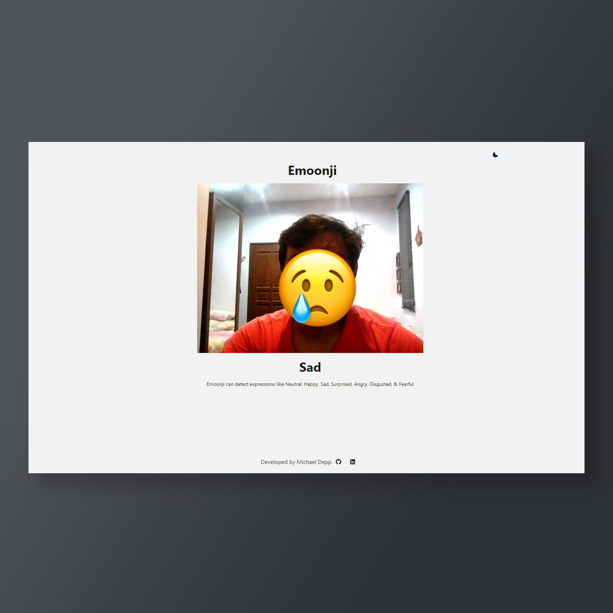

# Emoonji 🤖
Emoonji is an AI based Single Page Application, which tracks your facial expressions in real time and draw a suitable emoji.

Emoonji Link : https://bit.ly/Emoonji

The web application is fully developed in Next Js (React Js's web framework). The application uses Tensorflow models for the facial expression recognition. The application triggers the camera of the browser to send the video input. The video input will be drawn on a canvas, and the frames will be analysed and process the current expression of the user in real time. Then a suitable emoji will be drawn on top of the user's face.
The application name Emoonji is derived from 2 words, which is Emoji (english) + Moonji (tamil word for face). 

  

  

  

The entire application is full responsive. You can view the app in any viewport. This is the sample interface for the mobile view.

The application has a darkmode option on the right corner. This IconButton can switch the entire Ui to dark and light in real time.
The application is deployed to Vercel, and it works perfectly in the Vercel environment. You are most welcome to fork this repository and contribute to this simple project.

  (Make sure, you have Node Js and Npm installed in your machine)
   
  Installation :

  
 1. git clone https://github.com/MichaelDepp/Emoonji 

  
 2. cd Emoonji 

  
 3. npm install 

  
 4. npm run dev 

